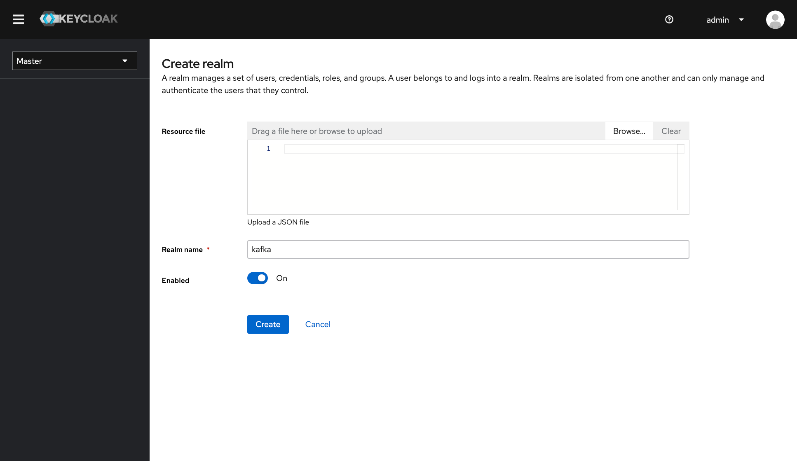
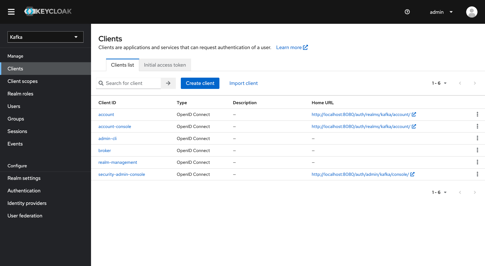
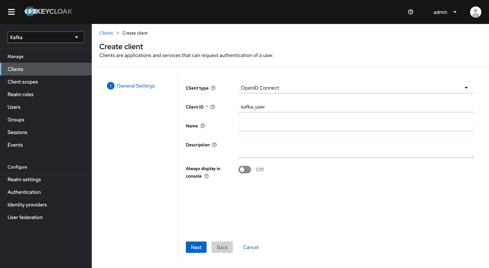
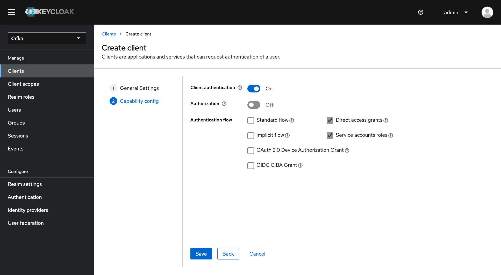
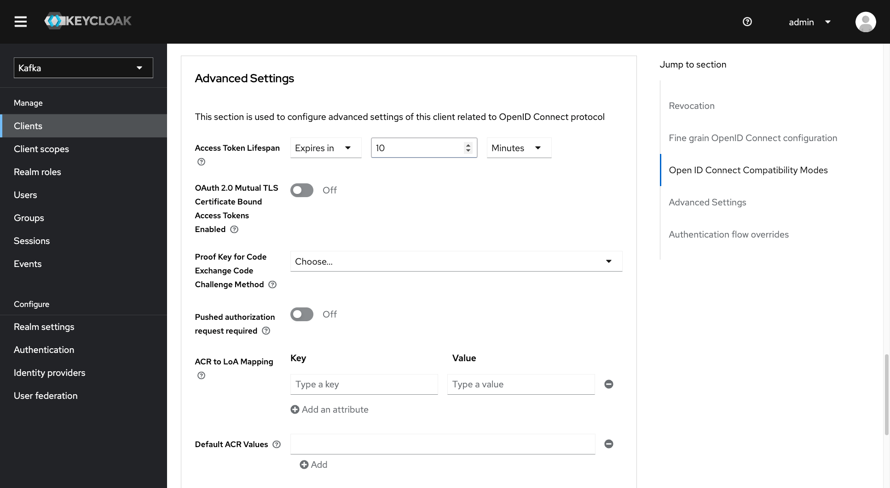
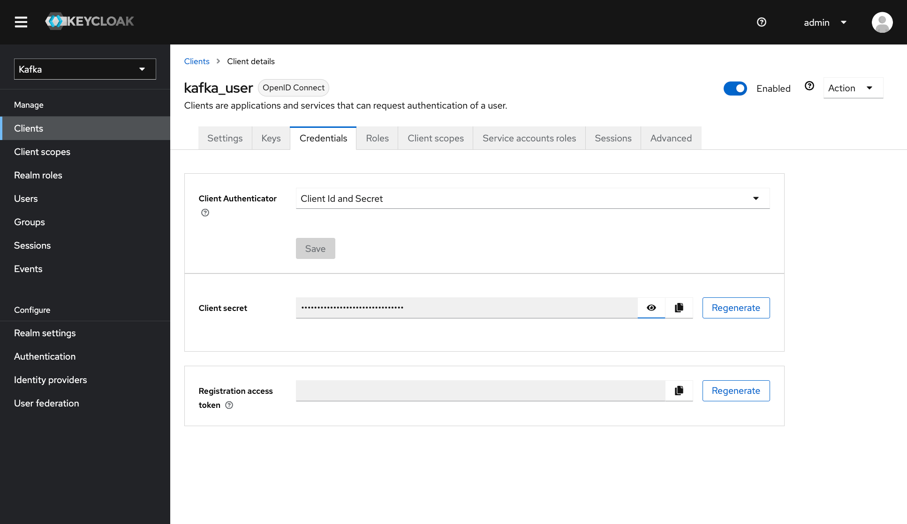

# Oauth demo

This example is rework of the original one  [by hifly81](https://github.com/hifly81/kafka-examples/tree/master/kafka-oauth-kip-768)

# Start the idp

    cd script
    ./01_start-idp.sh

Go to http://localhost:8080/auth/ and Wait for keycloack to be up and running

# Keycloak setup

Login into Keycloack with 

    Usr: admin
    Pwd: Pa55w0rd

- Login to http://localhost:8080 (admin/Pa55w0rd)
- Create a realm called kafka
- From the Clients tab, create a client with Cliend ID "kafka_user".
    - Change Access Type to Confidential, switch on "Client authentication"
    - Uncheck (disable) Standard Flow Enabled to OFF
    - Check (enable) Service Accounts Roles Enabled
- In the Advanced Settings below on the settings tab, set Access Token Lifespan to 10 minutes
- Switch to the Credentials tab
- Check Client Authenticator is "Client Id and Secret"
- Copy the client-secret in the file client-oauth.properties
- Save

## Create a realm called kafka

# From the Clients tab, create a client with Cliend ID "kafka_user".

# Setup client

- Change Access Type to Confidential, switch on "Client authentication"
- Uncheck (disable) Standard Flow Enabled to OFF
- Check (enable) Service Accounts Roles Enabled

# In the Advanced Settings set Access Token Lifespan to 10 minutes

# From Credentials tab check Client Authenticator is "Client Id and Secret"

- Copy the client-secret in the file client-oauth.properties
- Save

# Start Confluent Platform on Docker

    cd scripts
    ./02_start-cp.sh

Wait for CP to startup

**NOTE**: before starting the connection test be sure to copy the client secret in the [client-oauth.properties](client-oauth.properties)

# Test the oauth authorized config

The next command exectues a perf test on the broker with Oauth client athentication

        docker exec -it broker kafka-producer-perf-test --topic my_topic --num-records 50 --throughput 10 --record-size 1 --producer-props bootstrap.servers=broker:9093  --producer.config client-oauth.properties

