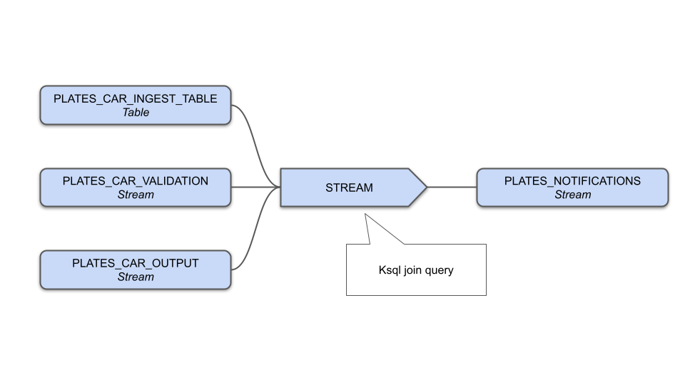

# Multi join example


This is a diagram of the ksql flow:



This example shows how to join the content of three topics and emit a message only once on each topic a message with the same car plate arrives.

It consist of a Table and two Streams.

# Start docker-compose

    ./start-cluster.sh

# Setup the tables and streams

Run this command to create the main Table and the streams:

    docker exec -it ksqldb-cli ksql http://ksqldb-server:8088 -f /home/appuser/ksql-setup.sql

```ksql-setup.sql``` contains these ksql statements:

    CREATE TABLE plates_car_ingest_table (plate_number VARCHAR PRIMARY KEY, car_model VARCHAR, doc_id VARCHAR, state VARCHAR) WITH (kafka_topic='plates_ingest', value_format='json', partitions=3);
    CREATE STREAM  plates_car_validation (plate_number VARCHAR, validation VARCHAR) WITH (kafka_topic='plates_validation', value_format='json', partitions=3);
    CREATE STREAM  plates_car_output (plate_number VARCHAR, recipient VARCHAR) WITH (kafka_topic='plates_output', value_format='json', partitions=3);

    CREATE STREAM plates_notifications AS
    SELECT 
        plates_car_ingest_table.plate_number AS plate_number, 
        plates_car_ingest_table.car_model AS car_model, 
        plates_car_ingest_table.doc_id AS doc_id, 
        plates_car_validation.validation AS validation,
        plates_car_output.recipient AS recipient    
    FROM plates_car_output
    INNER JOIN plates_car_ingest_table  ON plates_car_output.plate_number= plates_car_ingest_table.plate_number
    INNER JOIN plates_car_validation WITHIN 1 MINUTE GRACE PERIOD 10 SECOND ON plates_car_output.plate_number = plates_car_validation.plate_number;


# Insert data into the table

we insert 10 events in the main topic/table with the sql script:

    docker exec -it ksqldb-cli ksql http://ksqldb-server:8088 -f /home/appuser/ksql-plates.sql

# Start listening the notification output

    docker exec -i broker  kafka-console-consumer --bootstrap-server  broker:9092 --topic  PLATES_NOTIFICATIONS

# Insert data into plates_car_validation

Insert one or more of these entries int the ```plates_car_validation``` stream:

    docker exec -it ksqldb-cli ksql http://ksqldb-server:8088 -e "INSERT INTO plates_car_validation (plate_number, validation) VALUES ('NC355NQ', 'validated');"

    docker exec -it ksqldb-cli ksql http://ksqldb-server:8088 -e "INSERT INTO plates_car_validation (plate_number, validation) VALUES ('AF803LQ', 'validated');"

    docker exec -it ksqldb-cli ksql http://ksqldb-server:8088 -e "INSERT INTO plates_car_validation (plate_number, validation) VALUES ('GE330JV', 'validated');"

    docker exec -it ksqldb-cli ksql http://ksqldb-server:8088 -e "INSERT INTO plates_car_validation (plate_number, validation) VALUES ('CU378IG', 'validated');"


# Insert data into plates_car_output

Insert one or more of these entries int the ```plates_car_output``` stream::

    docker exec -it ksqldb-cli ksql http://ksqldb-server:8088 -e "INSERT INTO plates_car_output (plate_number, recipient) VALUES ('NC355NQ', 'NC355NQ@recipient.xyz');"

    docker exec -it ksqldb-cli ksql http://ksqldb-server:8088 -e "INSERT INTO plates_car_output (plate_number, recipient) VALUES ('AF803LQ', 'AF803LQ@recipient.xyz');"

    docker exec -it ksqldb-cli ksql http://ksqldb-server:8088 -e "INSERT INTO plates_car_output (plate_number, recipient) VALUES ('GE330JV', 'GE330JV@recipient.xyz');"

    docker exec -it ksqldb-cli ksql http://ksqldb-server:8088 -e "INSERT INTO plates_car_output (plate_number, recipient) VALUES ('CU378IG', 'CU378IG@recipient.xyz');"


# Check the output

You should receive an output join message on topic PLATES_NOTIFICATIONS once each topic has received at least a messages.